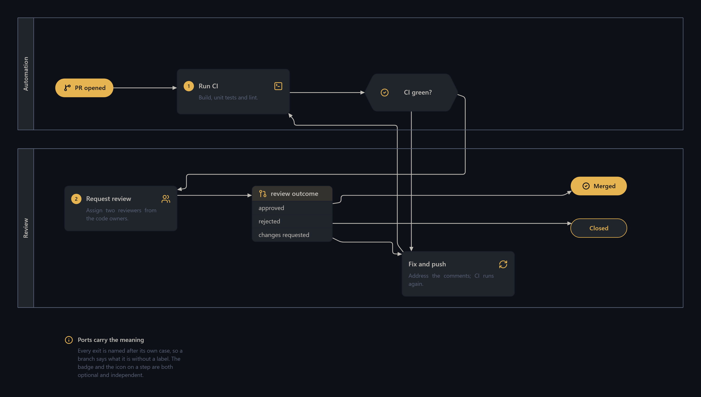
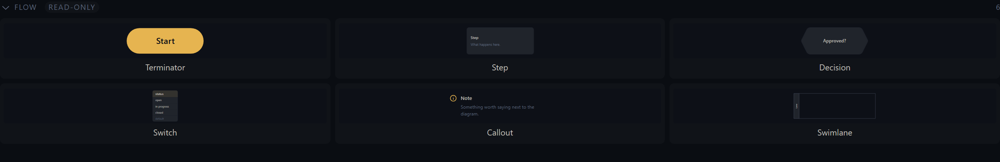
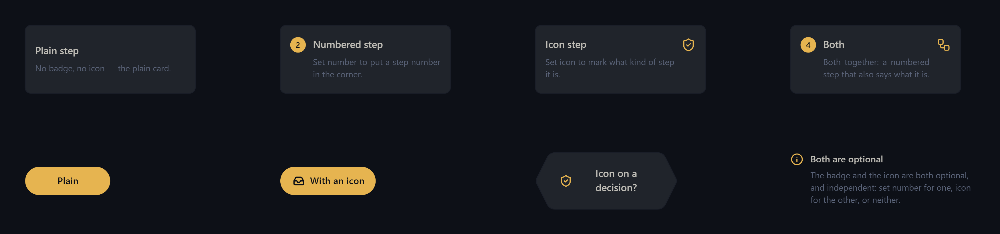

# swcad-flow

Flowchart pieces for [swcad](https://github.com/megashrieks/swcad): a step card with a title and a
description, a hexagonal decision with named exits, a switch that branches a value into a row per
case, a coloured callout, a swimlane and a start/end pill.

These are cards rather than the 1970s template shapes — the classical vocabulary of diamonds and
parallelograms is in [swcad-uml](https://github.com/megashrieks/swcad-uml). Everything here sizes
itself to its text rather than clipping it, and every colour is a theme token, so a diagram follows
whatever theme the editor is on instead of carrying six hard-coded hex values.

Branches name their own exits. A decision's are `yes` and `no`; a switch's are named after the
cases you typed. A connector leaving one therefore says which branch it is without a label on it.

## Example



## Components



| Reference | Name | What it is |
|---|---|---|
| `flow/terminator` | Terminator | The start or end of a flow: a pill with a word in it. Filled by default so it punctuates the diagram; turn Solid off for an outlined one. |
| `flow/step` | Step | A step in a process: a title, a description under it, an optional icon and an optional number badge. The card grows to hold its text rather than clipping it. |
| `flow/decision` | Decision | A branch point, drawn as a hexagon so it grows sideways with its question instead of ballooning like a diamond. Exits are named: `yes` leaves the right, `no` leaves the bottom. |
| `flow/switch` | Switch | A multi-way branch: a header naming what is being switched on, then one row per case, each with its own exit. |
| `flow/note` | Callout | An aside set on the background: an icon in the variant's colour, a heading and a sentence, with no frame. `info`, `warn`, `success`, `danger` and `neutral` each read differently without setting a colour by hand. |
| `flow/lane` | Swimlane | A labelled lane to put steps in, so a flow says who does what. A route with an end inside the lane is let through it; one merely passing over is not. |

### The step's badge and icon are independent



**Number** and **Icon** are separate options and either can be left blank. A numbered step with no
icon, an icon with no number, both, or neither — the card lays itself out around whichever are
present rather than reserving space for both.

### The switch's cases are one list

**Cases** is a single multi-line field, one case per line:

```
approved
rejected
changes requested
```

The card is as long as that list and no longer, and each line becomes a named exit. Every exit
appears on **both** sides of the card under the same name, so a connector takes whichever side it is
closer to without you choosing one. **Fallback** adds a final row (`default`, `otherwise`, whatever
you call it); blank it and the row and its exit go away.

## Installing it

swcad reads libraries from three places: the ones that ship with the app, the ones you have
installed, and a `libs/` folder inside a project. This one is installed.

Open the **Libraries & plugins** tab in the left rail, paste the repository URL into the box at
the top and press **Install**:

```
https://github.com/megashrieks/swcad-flow
```

swcad clones it into `~/swcad_libraries/`, checks that a `library.json` sits at the root and
reloads the palette. **Update** pulls the latest commit; **Remove** moves the folder to the
trash. Installed libraries are read-only in the editor, because an edit in place would make the
next update refuse to fast-forward — copy the folder into your project's `libs/` if you want to
change something.

The icons come from the base library that ships with swcad, so there is nothing else to install.

## Licence

MIT, see [LICENSE](LICENSE).
